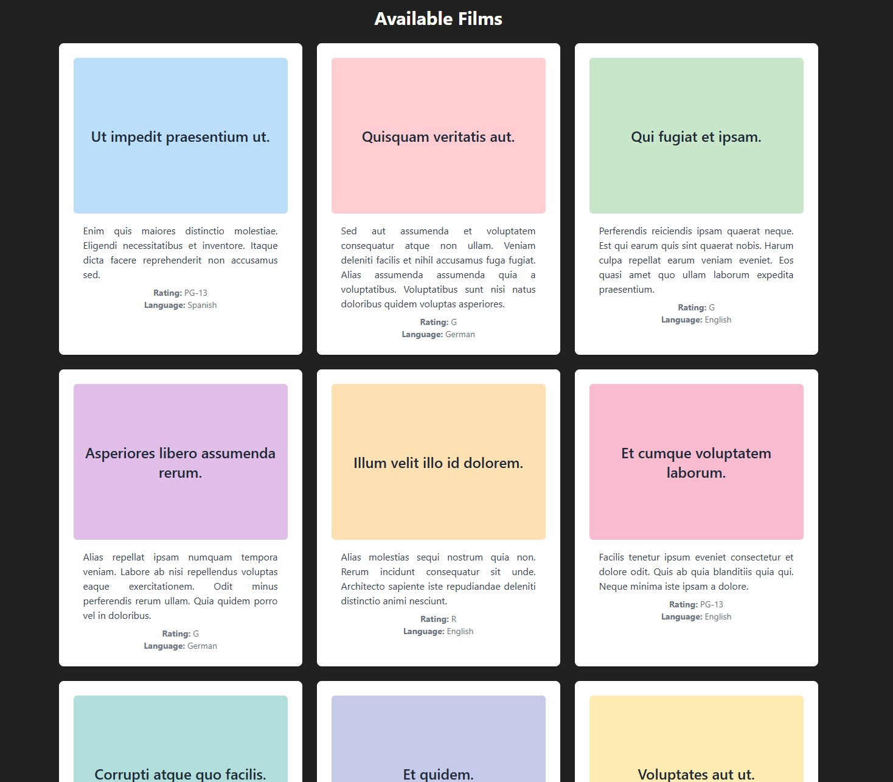

# Drive-in Theater App

## Table of Contents

- [General Info](#general-info)
- [Description](#description)
- [Screenshot](#screenshot)
- [Technologies](#technologies)
- [Setup](#setup)
  - [Frontend Setup](#frontend-setup)
  - [Docker Setup](#docker-setup)
  - [Database Setup](#database-setup)
  - [Swagger Setup](#swagger-setup)
- [Running](#running)
  - [Database Running](#database-running)
- [Testing](#testing)
- [Status](#status)
- [Created](#created)

## General Info

The Drive-in Theater application is a Laravel and React-based platform that allows users to explore and book tickets for drive-in movie screenings. It provides features for movie management, screening schedules, and a booking system within a modern, user-friendly interface.

## Description

The Drive-in Theater app allows users to view available movies, schedule screenings, and book tickets for drive-in movie experiences. The backend is built using Laravel 10, while the frontend leverages ReactJS for an interactive user experience. The application also features RESTful APIs for seamless data interaction between the backend and frontend.

## Screenshot



## Technologies

- Laravel 10
- PHP 8
- ReactJS (with Vite, Axios and React Router)
- MySQL
- Tailwind CSS
- Docker
- Adminer (Database management)
- PHP Debug Bar
- PHPUnit
- Swagger/OpenAPI

## Setup

### Clone the Repository

```bash
git clone https://github.com/ivorszaniszlo/drive-in-theater.git
```

### Backend Setup

Navigate to the project directory and install backend dependencies:

```bash
cd drive-in-theater
docker-compose exec app composer install
```

### Frontend Setup

Navigate to the frontend directory and install dependencies:

```bash
cd frontend
npm install
```

Install Axios for API calls and React Router for navigation:

```bash
npm install axios react-router-dom
```

### Environment Setup

Set up environment variables:

```bash
cp .env.example .env
docker-compose exec app php artisan key:generate
```

### Database Setup

Set up the database and run migrations:

```bash
docker-compose exec app php artisan migrate --seed
```

To access the database management interface, navigate to `http://localhost:8081`.

To access the database, you can use Adminer by navigating to `http://localhost:8081`. Use the following credentials:
- **System**: MySQL
- **Server**: 127.0.0.1
- **Username**: root
- **Password**: root
- **Database**: laravel_10_drive_in_theater

If you need to reset the database (for example, after changes to migrations), use the following command:

```bash
php artisan migrate:refresh --seed
```

This command will drop all tables, run all migrations again, and seed the database with initial data.

### Install PHP Debug Bar

```bash
docker-compose exec app composer require barryvdh/laravel-debugbar --dev
```

### Set Up React Application

If you need to create a new React application (only do this if not already present):

```bash
docker-compose exec app npx create-react-app frontend
```

### Docker Setup

Build and run the Docker containers:

```bash
docker-compose up --build
```

### Swagger Setup

To set up Swagger for API documentation, follow these steps:

1. Install the Swagger package (already installed in this setup):
   
   ```bash
   docker-compose exec app composer require "darkaonline/l5-swagger"
   ```

2. Publish the Swagger configuration:
   
   ```bash
   docker-compose exec app php artisan vendor:publish --provider="L5Swagger\L5SwaggerServiceProvider"
   ```

3. Generate the Swagger documentation:
   
   ```bash
   docker-compose exec app php artisan l5-swagger:generate
   ```

   You can access the Swagger UI for API documentation at `http://localhost:8000/docs`.

## Running

### Backend

Serve the Laravel backend application:

```bash
docker-compose exec app php artisan serve --host=0.0.0.0 --port=80
```

### Frontend

Serve the React frontend application:

```bash
docker-compose exec app npm start --prefix frontend
```

Access the backend at `http://localhost:8000` and the frontend at `http://localhost:3000`.

For frontend development, start the Vite development server by running:

```bash
docker-compose exec app npm run dev --prefix frontend
```

Access the application at `http://localhost:8000`.

### Database Running

To ensure the database is running correctly, use the following command to connect to the database container:

```bash
docker-compose exec mysql mysql -u root -p
```

Use the password `root` when prompted.

## Testing

To run the tests, use the following command:

```bash
docker-compose exec app php artisan test
```

This command will execute the unit and feature tests defined for the application, ensuring that all functionality is working as expected. The tests cover the main features, such as listing films, showing details of a film, creating, updating, and deleting films.

If you need to refresh the database before running tests, use the following command:

```bash
php artisan migrate:refresh --seed
```

This will ensure that the database is in a clean state before running the tests.

## Status

Active

## Created

2024
